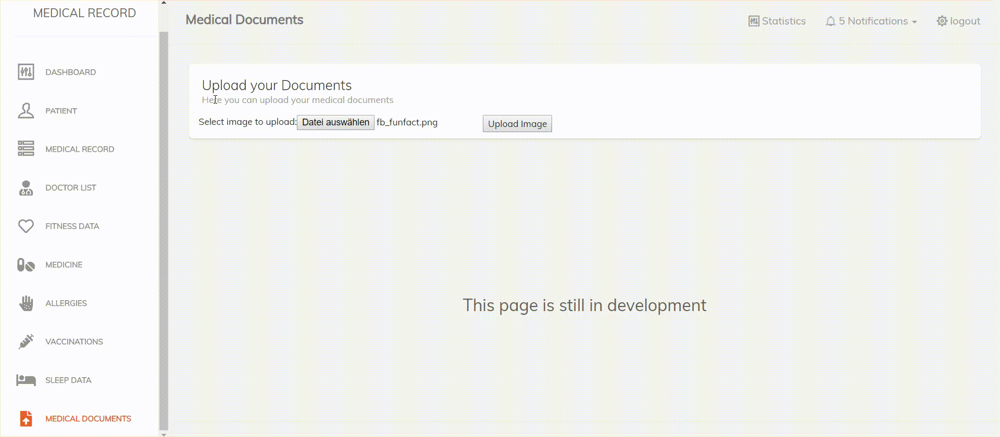
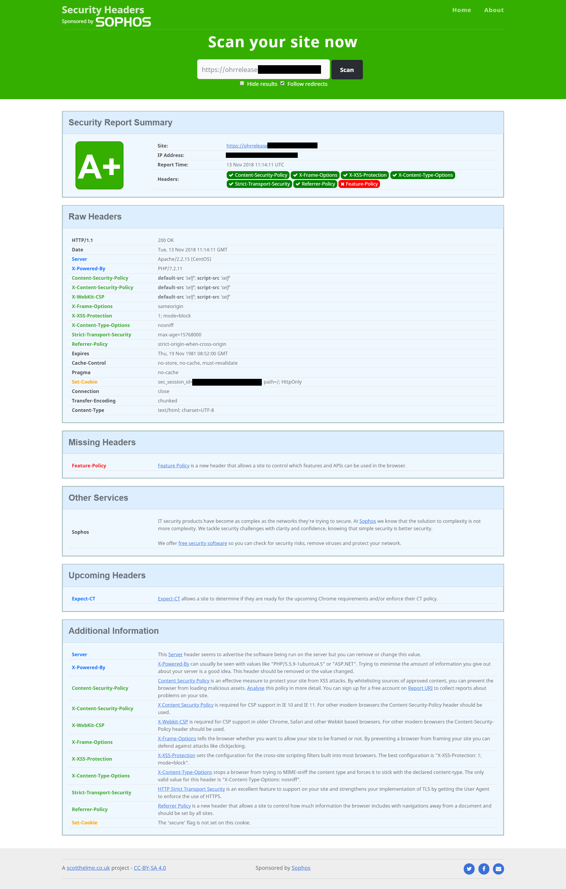
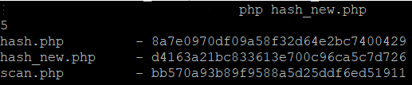
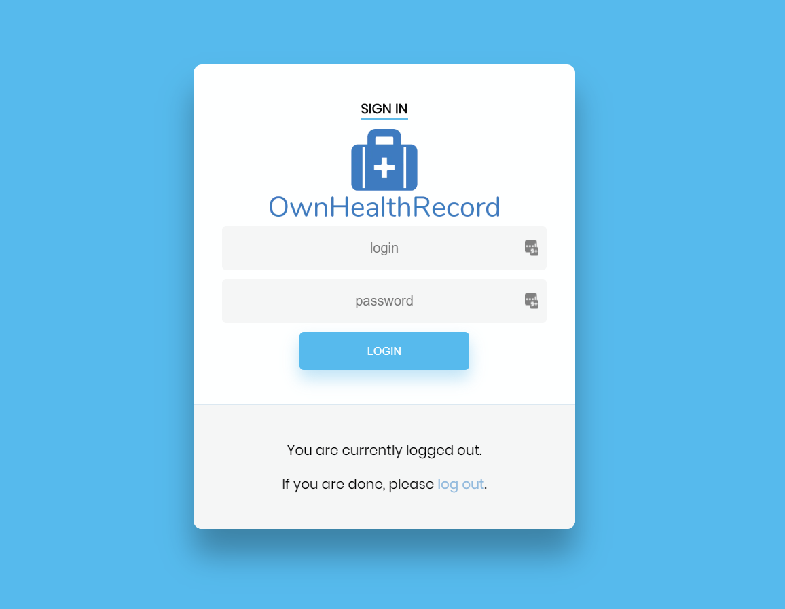

# The Developer Log

### 18.04.2019 - Im still alive ;)

Hey guys

if you read this, than you are still liking OwnHealthRecord or you maybe got this repo attention.

I want to tell you, this repo is not dead, but Im very busy with my jobs I have, so adding new features is not easy to realize if I dont have time.

Even I want to tell you, that a investor came to and wanted OwnHealthRecord for its system, but due he never get back again, I suppose it was a scam and wanted to misuse it.

Anyway, I changed the license model, if you are a private person, you are free to use, modify, improve, etc. you can share it with friends etc. but the same license belongs to them.
If you want to use it as a company or commercial way, you have to request the permission from me. If I find it used in commercial products, I will take legal steps.

I love open source and thats important for development, but I dont want that others misuse the work or get rich by this.
So if you are using it for you, your friends or your family, you are fine and dont have to worry about it :).

What Im even thinking about is, to make it as a SaaS platform, but this will maybe come in the next years.

Recently I just fixed some smaller code parts and the medical-document page, so the upload is working now and you can access your documents from it.

Have a nice time and if you see a bug or wish a feature, please let me know and open a new issue.

### 23.01.2019 - Gitter Community Chat

Hey guys

through its easier to communicate and solve problems, as well to get things communitcate, I want to notify you about, that now there is a Gitter Community for OwnHealthRecord

https://gitter.im/ownhealthrecord

### 14.01.2019 - Donations and future plans

Hey guys

my latest log is already some weeks old, and maybe someone of you already think that the project is dead, but no, its not dead, its just in hibernation ;) . The Problem I currently have is, to earn more money, so free time projects have a lower priority. So how to solve it?

In general the features depends on time, my time and time is costly, so Im looking for monthly donations to continue the development. Its working so, if you donate me money, I can, then if its enough, take my time to continue the development, instead of doing another work.

I got a email from a user who is really interested in OwnHealthRecords and would like to donate 10$ per month. If 10 people do this, I could realize nearly every month one new feature. How awesome is it? I know, some of you dont want to pay for free software, but remember, the code is open source, you can modify it by yourself, but this make it more complicated for me as developer. Who is paying me so I can pay my bills?

You have seen that I update you here always about the current situation and I shared several alpha releases in few weeks, so for testing purposes its already good to go, but not yet for production.

Time is money and money is time, so I want to show you that what is planned and how much time I need for this.

* 50$ - Export Functionality JSON (5h)
* 80$ - Integrate Multi User Functionality (8h (1-Work Day))
* 100$ - Improve Installer to automate populate the database (no more hassle with phpMyAdmin (10h))
* 150$ - Health Check Reminder Functionality (15h)
* 150$ - Import Functionality JSON (so export from old and import to new Version, machine, etc.)
* 500$ - Integrating Framework for SQL etc. based databases

That are the costs for the further development.
Other SQL Systems instead of MySQL are out of my focus, so I have to take more time to get in it and test the database frameworks to work properly with everything. I found already some which providing MySQL, MSSQL, SQLite, MariaDB, PostgreSQL, Sybase, Oracle.

So I hope for everyone is here something :)

#### How it will continue?

To continue the development, I need the donations, really, I dont want to ask for investors to get it fund.

On OpenCollective you can donate me:
https://opencollective.com/ownhealthrecord

There you can even see the progressbar in the top and how much money got donated. If you donate, please write in the public message for what function you are donating. Every month I will share with you which function will come as next, so no one who dont want to support a function they dont need, is pushed to donate for it. 
But for long term support and further development, I were glad, if you can support and donate every month interval.

Thank you for your time

### 22.11.2018 - Busy and Chart Libraries
Hey guys

I just want to give you an update, that this week/weekend I will have no time to make an update of the OwnHealthRecord. This has personal reasons and even financial stuff, I have to work more to earn more money and so one (Capitalism, you know?), I would like to spend more time in the development, but I suppose no one want to buy it as product due its not finished, donation will be not enough and providing it as a service is not possible, due its not certified as medical software.

Anyway, I want to update you about, that I took a look on some nice charts for it, which will come a later time on the dashboard and will visualize as example, your weight over time etc.

Here are some libraries where I think this can be used (at least one of them in future):

* http://visjs.org/
* https://c3js.org/
* https://www.chartjs.org/
* https://github.com/danvk/dygraphs

### 19.11.2018 - Great way for encryption found!
Hey guys

I found randomly an interesting article by a developer who shared the easy way of encryption in php.

https://nazmulahsan.me/simple-two-way-function-encrypt-decrypt-string/

With this function and code snippets, I will adapt it for the encryption of the data in OwnHealthRecord v0.5-ALPHA.

@ItalyPaleAle has even explained his idea how to solve the problem with secret key:

1. Each record is encrypted with a separate key. The key is encrypted and stored In the same row as the record. 
2. To encrypt the key, use a “master key” derived from the user’s password. Store this master key in the same row as the user’s data. 
3. When the user logs in, decrypt the master key and keep it in memory for the length of the session.

I hope this can be integrated easily and make the whole application more safe.

Additional information around hashing security https://crackstation.net/hashing-security.htm

### 18.11.2018 - The Installer is back! (and Secret key problem)
Hey guys

I have worked a little on it and to fix the points for the next release.
One thing I cared about was/is the hard coded secret for the AES_Encryption for MySQL. Now its generated by random_bytes(20) and I hope this will solve the random factor. To make this usable, I have re-enabled the installer.php, which is still slick, but do what it needs to do, you type in your mysql credentials (the secret get created automatically after submit) and everything will be saved in the psl-config.php. Afterwards you get forwarded to the index.php, than you can delete the installer.php.

The another problem stay, the secret is still in plain text and I dont know how it can be properly solved, so that it doesnt get more complicated. It can be hashed, yes, but this would mean it has to be in the mysql table too, so if the database get compromised, we face the issue that the hash get stolen and the data get decrypted. I will look for a solution on that.

### 18.11.2018 - Plans for the next release v0.5
Hey guys

through your great feedback on the last reddit thread, I take your ideas very welcome. For that the next release will be more focused on secure.

Below you will see a list which things has to be added:

* **Replace** <a href="https://www.reddit.com/r/selfhosted/comments/9xrinq/ownhealthrecord_v04_alpha_released_for_all_who/e9yb1sr/" target="_blank">**~~SHA-512 with Argon2~~**</a> (will be replaced with PBKDF2 )
* **Replacing the hard coded secret key in db_connect.php with a random generated** (*While data is encrypted in the DB, you're using the same encryption key for everything and everyone.The key is then stored on the app's config file in plain text. Best practice is to: use a different key for each record, and derive that key from an "user key" which is unique to each user. The user's key should be encrypted as well, using a key derived from the user's password (don't use the user's password as user key, because passwords can change).*)
* **Find a better method for MySQL Encryption**
(*You are encrypting data using MySQL's AES_ENCRYPT, which defaults to 128-bit keys and ECB mode, with no IV. This is not recommended. See this excellent thread: https://crypto.stackexchange.com/questions/20941/why-shouldnt-i-use-ecb-encryption*)
* **Replace password validation with session validation**
(*You don't need to check the password on every single page to validate if the session is active. Session variables are stored in the server, and so it's just redundant. Instead, focus on protecting the session token (see #4), and make sessions shorter.*)

### 16.11.2018 - Bug fixes and upload functionality
Hey guys

Today I have made some bug fixes which caused by the applying of the security functions. 
Additional I have added now the upload functionality for the medical-document.php where you will be able to upload documents, but still its not protected, so everyone would be able to access this files. This for the moment more a demonstration of which kind of function will come.
I had in plan integrate even viewer libaries to allow the user to view the medical files like DICOM etc. inside OwnHealthRecord.

Furthermode beside being able to upload the files, you can view and open them over a directory listing. Unfortunately its still some bugged and I could not solve it for the moment, so the modified date and size doesnt shows up (can you fix it?). 

### 15.11.2018 - XSS protection applied
Hey guys

Today in the morning I have applied the XSS hardening fix to the github repo, this can be found in the functions.php, the function is called XSSdisarm ;) 
This will prevent that XSS attacks will be executed in the application. I have tested the hardening against persistive and non-persistive attacks.
The XSS based DOM attack which attack the JS part should be not possible, due there is no js which belongs to the formulas after the login.
The new protection will be released in the next version this weekend.

Used sources to fix it:

https://stackoverflow.com/questions/1996122/how-to-prevent-xss-with-html-php

https://www.php-einfach.de/experte/php-sicherheit/cross-site-scripting-xss-in-php/

### 15.11.2018 - CSRF is fixed now(?)
Hey guys

I took the advices from redditors serious and looked for solutions how to fix the security bugs in the OwnHealthRecord. So for now I think the CSRF problem should be fixed. I have used tutorial manuals for that have applied the protection code on the links where sensitive information are send.
The latest changes you can see now in medicine, medical-record, doctors-list; 
For the later coming pages, this will be added by default.
I dont have tested the changes for safety, so I will do, if I have implemented a test function. If you want to test this fix, please do it and let me know over opening an issue. :) 

Used sources to fix it:

https://stackoverflow.com/questions/6287903/how-to-properly-add-csrf-token-using-php/31683058#31683058

https://www.php-einfach.de/experte/php-sicherheit/cross-site-request-forgery-csrf/

### 13.11.2018 - Open Source and Security
Hey guys

through my last reddit post in the subreddit selfhoster, I got 2 responses regarding the security of the OwnHealthRecord application and so I have checked it and it is true, the webapp is not totally secure and still contains some points to harden it before it can be used in production. Im happy about this, due if it doesnt were open source, no one would know about that security bugs. Now I know what to change and to fix and hope to get some security issues fixed until the next release, but before I have to test it. Unfortunately, it seems that the performance is going through the additional security down and so it take longer to switch to another page, but I think this can be even improved.

On my test instance I made some tests and got a A+ in the results of a <a href="https://securityheaders.com" target="_blank">securityheaders.com</a>.
If you running it already, than you will get a F in the test, due there is no secure headers inside. 

**Please wait until the application is far enough developed, before using it productive**

### 11.11.2018 - Some stuff for yesterday

Hey guys

yesterday I have at the end published 2 releases (v0.3-alpha and v0.3.1 fix), so here is a summary of the updates made in the current version v0.3.1:

* ADDED AES_Encryption functio
* ADDED Allergies Section (preparation)
* ADDED beautiful login form
* ADDED new signup form
* ENHANCED Login.php is now index.php by default
* ENHANCED doctorlist.php email addresses contains now mailto: handler to write emails on click
* ENHANCED Medication Section, now has more space to make the entries
* FIXED Typos fixed
* FIXED Some broken links in the sidebar

As you see, there are some cool changes and I hope to realize soon more.
My current plan is to release every weekend a new Version. This has the reason, due Im working while the week and can not take care too much about a free time project Im doing here.

### 10.11.2018 - Back to work
 Hey guys
 
 after one month of break on this project, caused by another workload and unmotivation, I have finally brang me up to continue the work on it. One problem I faced in the Guardian is, that its seach for changed files in subdirectories is not really so easy as I thought. For that reason I have stopped the work on the Guardian for the moment.
 I started now to make some tests with the encryption and decryption of the information in the MySQL database.
 
 The medical-record.php, doctor-list.php and medicine.php pages now encrypt and decrypt the information. After filling the fields with your medical information and click on save entry, the data will be handled by insert-#X.php, this is encrypting the data with AES_ENCRYPT and a secret key you have to use in your db_connect.php. The data will be stored encrypted in the MySQL database table, so even if you get a data breach in your MySQL Server, without the Secret key, your data will be safe (no guarantee, but its a safe way to encrypt data) and can not be decrypted. For a later release I hope to find a solution which make it possible to another key instead of a manually hard coded in the db_connect.php
 
 Check it out on the screenshots below (first: how it looks after sending the data; second: how it looks in your database)
 
 

### 19.10.2018 - run your Server secure
Hey guys

I just have added some links about how to run your server in a secure way for production usage. I think this are information which you should definitive check out before running OwnHealthRecord for own production usage (even its not yet ready for production). Check out the links in the README file.

### 13.10.2018 - Guardian
Hey guys

on the roadmap I wrote about a "Guardian" and yes, this is maybe a own project for this project. Guardian will run over a cronjob from time to time and will check the files whether it got changed etc. This is pretty interesting. I decided to get it verified with a hash function. So the first run is a indexing of all files in the application folder, Guardian will create a list (I think about a CSV file or plain text for the moment) and in this file will be every file and its hash listed (still thinking about which hash function will be nice enough, I suppose SHA256/512?). If there will be another run, Guardian will check every hash of the files again and verify it with the origin hash list. If they are valid, everything is fine. But if it is not the same, Guardian will write this incident in a log file and send it over email to the user.
For now I have the scan and hashing functionality. See screenshot:

### 11.10.2018 - Login get beautiful
Hey guys

as already communicated in the roadmap, I dont like the latest basic html code login interface, so I was on the search and looked for an open source free available login form, and I found it.

For now its in the repo only, so you have to clone it to test it, but its just for the eyes, nothing regarding the functionality.
Ps. Did I told you about the new logo I created :) (ok, an free icon and a text, well how you want to call it)?

### 11.10.2018 - Start of the Developer Log
Hello,

Yes, thats my first try to start a developer log book.
It should not be like a blog, but more information stuff of what changes are made or what just got changed etc. 